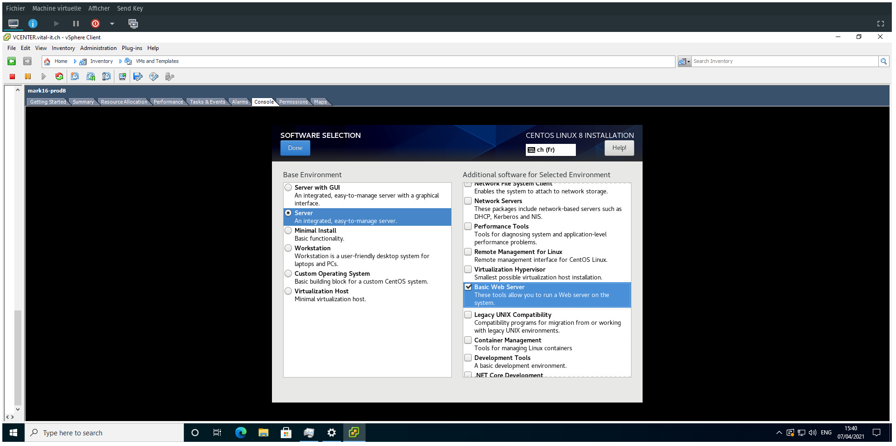
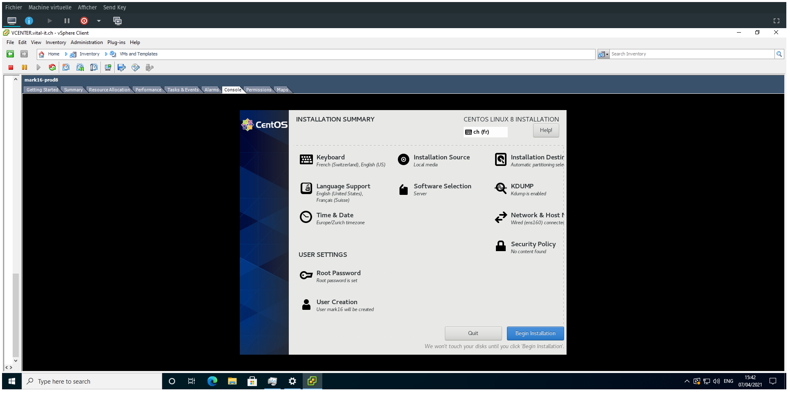

# MARK16 MR API

(C) Copyright SIB Swiss Institute of Bioinformatics 2021, available from <https://github.com/sib-swiss/dh-mr-mark16> under GNU GPL v3.0 See LICENSE and THIRD-PARTY-NOTICE.

This API is a part of the main SNSF MARK16 project: <https://mark16.sib.swiss>
DH+, SIB Swiss Institute of Bioinformatics, CH, 2020, ISSN 2673-9836

<!-- [TOC] -->
<!-- {:toc} -->
<!-- The winning format is below -->

## Definition and credits

This manuscript viewer makes it possible to view manuscripts along with their transcripts, and in some extent manipulate the images.

The use of an internal image server to make [Mirador](https://projectmirador.org/) being able to work with images served locally is based on a test case available at <https://iiif.github.io/training/intro-to-iiif/>.

The first implementation of this API has been made by __Jean-Bernard Dugied__, then developed by __Jonathan Barda__ and __Silvano Aldà__.

The API is now maintained by __Jonathan Barda__ and __Silvano Aldà__.

The PI of the five-year SNSF MARK16 project is __Claire Clivaz__ and the team is composed of __Mina Monier__, post-doc, __Elisa Nury__, research scientist, with __Jonathan Barda__ and __Silvano Aldà__, Core-IT software developers. The project is hosted at Digital Humanities +, SIB Swiss Institute of Bioinformatics.

## Local setup

This section will explain the required steps to have a complete and working local development environment.

### Docker

To deploy the project within the new refactored structure, you'll have to install `docker` and `docker-compose` or if using the latest `docker` version, simply make an alias for the `docker compose` command:

```
alias docker-compose="docker compose"
```

### Web server

To start the local web server, simply run the following commands:

```bash
# Clone the project
git clone https://gitlab.sib.swiss/mark16-vre-group/manuscript.git

# Move to the project folder
cd manuscript

# Change branch
git branch dev-refactor-to-expose-only-public-folder

# Deploy the stack and start the server
# The command below will do the following in this order:
# 1. Deploy the stack and start the web server container
# 2. Run 'composer' commands inside the container
# 3. Show container logs
docker-compose up -d && \
docker exec -it $(docker ps --filter 'name=manuscript' -q | head -1 -) bash -c 'composer install -d /var/www/html/htdocs && composer update -d /var/www/html/htdocs' && \
docker-compose logs -f
```

> The port `80` must be available before running the container.

To clean-up everything, simply run the following command:

```bash
# This command will stop the running container
# and delete created images and networks
docker-compose down --rmi all --remove-orphans
```

### Access to the application

The application is reachable only from __HTTP__ when ran locally:

* http://localhost

But if you are using a local dev VM then you'll have to use a proxy to reach the deployed container or create a similar connection script:

```bash
#!/bin/bash

((!$#)) && echo -e "\nUsage: $0 local-port\n" && exit 1

JUMP_PORT=$1
JUMP_USER=[USER]
JUMP_HOST=[HOST]
SSH_KEY=[SSH_KEY_NAME]
TARGET_URL="http://[VM_IP]"
PROXY_SCHEME=socks5
PROXY_URL="${PROXY_SCHEME}://localhost:${JUMP_PORT}"

echo -e "\nStarting SSH tunnel...\n"
ssh -nNTf -A -i ${HOME}/.ssh/$SSH_KEY -D $JUMP_PORT ${JUMP_USER}@${JUMP_HOST}
# chromium-browser --temp-profile --incognito --new-window --proxy-server=$PROXY_URL --app=$TARGET_URL
chromium-browser --temp-profile --incognito --new-window --proxy-server=$PROXY_URL $TARGET_URL
echo -e "\nClosing SSH tunnel...\n"
kill -9 $(pgrep -fi "ssh -nNTf -A -i ${HOME}/.ssh/${SSH_KEY} -D $JUMP_PORT ${JUMP_USER}@${JUMP_HOST}")
```

> Here `[HOST]` mean the __jump host__ to use for the connection to the VM.

Replace `[USER]`, `[HOST]`, `[SSH_KEY_NAME]` and `[VM_IP]` by the correct values and save the script as `web-access.sh` for example then run it:

```bash
# Make the script executable
chmod -v +x web-access.sh

# Run it
./web-access.sh [LOCAL_PORT]
```

Replace `[LOCAL_PORT]` by the port to use locally and a `chromium-browser` window will be opened and you should see the project running.

## Server setup

Hardware:

* CPUs: 4 vCPUs
* RAM: 4 GB
* Disk: 32 GB

OS:

* Distrib: __CentOS__ / __RockyLinux__ 8.x
* Installation type: `Server` (__without GUI__)
* Additional packages: `Basic Web Server`

> _Currently deployed servers might still run under **CentOS** 8.x._




### PHP

The project is built with `PHP` version __8.1__.

Required packages / extensions:

1. `php-cli`
2. `php-fpm`
3. `php-gd`
4. `php-opcache`
5. `php-xml`
6. `php-sqlite3`
7. `php-pdo`
8. `php-mbstring`
9. `php-zip`
10. `composer`

> The `php-curl` extension might be already installed but it is not required by the code. Also, the micro-framework behind the project ([F3](https://fatfreeframework.com/3.8/home)) will rely on `TCP` sockets when `curl` is not installed.

To install everything once the `OS` is ready, simply run the [install](scripts/install.sh) script.

> The current [install](scripts/install.sh) script is __only compatible with Ubuntu based distribs__, it will adapted soon for CentOS.
>
> In the meantime, you can do the following for __CentOS__ / __RockyLinux__:
>
> * Search `PHP` extensions with `yum search [php-extension]`
> * Then `yum install [php-extension]`
> * And go to the next section to install `composer`.

### Composer

To automatically install / update `composer` to the latest version, simply run the [install-composer.sh](scripts/install-composer.sh) script.

> It should be already installed if you have run the [install.sh](scripts/install.sh) script.

Once installed, run the following commands:

```bash
# Move to the project root
cd [web-root]/htdocs

# Run the 'composer' commands
composer install && composer update
```

### SELinux

If `SELinux` is enabled on the server, you will then need to apply the following contexts:

* `httpd_sys_script_exec_t`
  * on folder __`[web-root]/htdocs`__
* `httpd_sys_rw_content_t`
  * on folder __`[web-root]/data`__
* `httpd_log_t`
  * on folder __`[web-root]/data/logs`__
  * on folder __`[web-root]/logs`__

Using the following commands:

```bash
# Set SELinux context
sudo semanage fcontext -a <context> "<target>(/.*)?"

# Apply SELinux context
sudo restorecon -Rv <target>
```

See [here](https://www.serverlab.ca/tutorials/linux/web-servers-linux/configuring-selinux-policies-for-apache-web-servers/) for more details.
